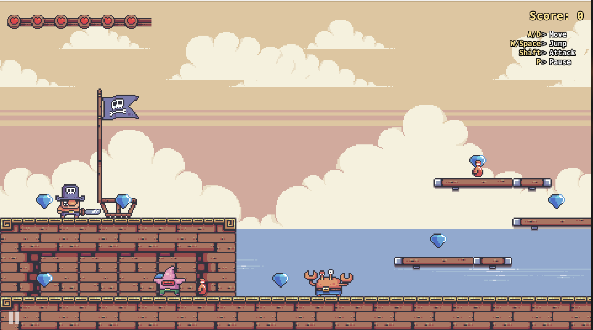

# Treasure Island

A 2D horizontal-scrolling action platformer built in Java for COMP 3609 (Game Programming). The player controls a pirate captain who fights through two levels — the Pirate Ship and Palm Tree Island — defeating enemies and collecting treasure.



## Requirements

- Java 17+ (JDK; not just a JRE)

Check with:

```
java -version
javac -version
```

## Run

From the project root:

```
# Compile everything into ./out
javac -d out -sourcepath src src/Main.java

# Launch the game
java -cp out Main
```

The compiled classes land in `out/` and the runtime reads `config/`, `sounds/`, and `assets/` via relative paths — so always run from the project root.

## Controls

| Key                | Action         |
| ------------------ | -------------- |
| A / Left           | Move left      |
| D / Right          | Move right     |
| W / Up / Space     | Jump           |
| Shift              | Attack         |
| P                  | Pause / resume |
| Enter              | Start / restart |
| Q                  | Quit           |

On the Game Over and Victory screens you can also click the on-screen **Try Again** / **Play Again** or **Quit** buttons.

## Project layout

```
src/                Java source
  Main.java         Entry point — creates the JFrame and starts the loop
  engine/           Game loop, camera, level loader, managers (singletons)
  entities/         Player, enemies, bosses, collectibles
  interfaces/       Drawable, Updatable, Collidable, Attackable
  levels/           Level base class + Level1, Level2
  rendering/        Background, terrain, decor, effects, HUD
config/             Level layout files and tunable game properties
sounds/             In-game audio (see sounds/CREDITS.md for attribution)
assets/             Sprite sheets and UI art
```
